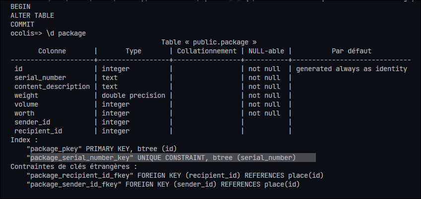

# O'colis

## Version 1


## Version 2

Changement du type de la colonne "serial_number" en champ texte


## Version 3

Rendre la colonne "serial_number" UNIQUE



## Version 4

Modifier une colonne et ajouter 2 colonnes 


## Version 5

Ajout des colonnes pour récupérer les dates

```shell
ocolis=> \d package
                                          Table « public.package »
       Colonne       |           Type           | Collationnement | NULL-able |          Par défaut
---------------------+--------------------------+-----------------+-----------+------------------------------
 id                  | integer                  |                 | not null  | generated always as identity
 serial_number       | text                     |                 | not null  |
 content_description | text                     |                 | not null  |
 weight              | double precision         |                 | not null  |
 height              | integer                  |                 | not null  |
 worth               | integer                  |                 | not null  |
 sender_id           | integer                  |                 |           |
 recipient_id        | integer                  |                 |           |
 width               | integer                  |                 | not null  |
 depth               | integer                  |                 | not null  |
 request_time        | timestamp with time zone |                 | not null  | now()
 expedition_time     | timestamp with time zone |                 |           |
 delivered_time      | timestamp with time zone |                 |           |
Index :
    "package_pkey" PRIMARY KEY, btree (id)
    "package_serial_number_key" UNIQUE CONSTRAINT, btree (serial_number)
Contraintes de clés étrangères :
    "package_recipient_id_fkey" FOREIGN KEY (recipient_id) REFERENCES place(id)
    "package_sender_id_fkey" FOREIGN KEY (sender_id) REFERENCES place(id)

```