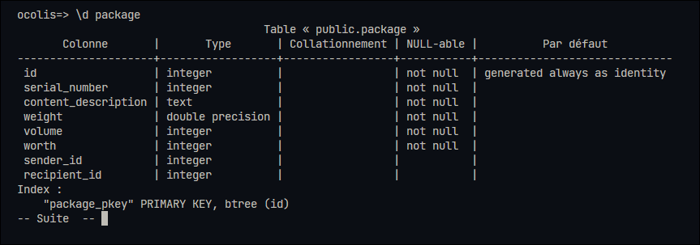
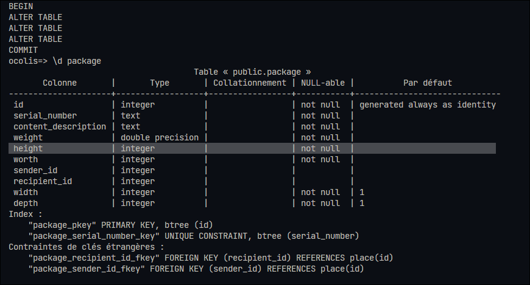
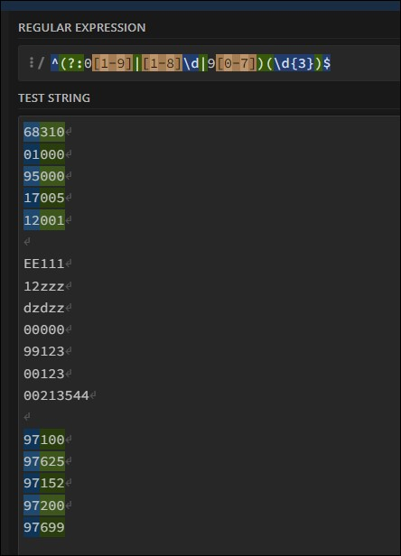

# O'colis

## Version 1



## Version 2

Changement du type de la colonne "serial_number" en champ texte


## Version 3

Rendre la colonne "serial_number" UNIQUE


## Version 4

Modifier une colonne et ajouter 2 colonnes



## Version 5

Ajout des colonnes pour récupérer les dates

```shell
ocolis=> \d package
                                          Table « public.package »
       Colonne       |           Type           | Collationnement | NULL-able |          Par défaut
---------------------+--------------------------+-----------------+-----------+------------------------------
 id                  | integer                  |                 | not null  | generated always as identity
 serial_number       | text                     |                 | not null  |
 content_description | text                     |                 | not null  |
 weight              | double precision         |                 | not null  |
 height              | integer                  |                 | not null  |
 worth               | integer                  |                 | not null  |
 sender_id           | integer                  |                 |           |
 recipient_id        | integer                  |                 |           |
 width               | integer                  |                 | not null  |
 depth               | integer                  |                 | not null  |
 request_time        | timestamp with time zone |                 | not null  | now()
 expedition_time     | timestamp with time zone |                 |           |
 delivered_time      | timestamp with time zone |                 |           |
Index :
    "package_pkey" PRIMARY KEY, btree (id)
    "package_serial_number_key" UNIQUE CONSTRAINT, btree (serial_number)
Contraintes de clés étrangères :
    "package_recipient_id_fkey" FOREIGN KEY (recipient_id) REFERENCES place(id)
    "package_sender_id_fkey" FOREIGN KEY (sender_id) REFERENCES place(id)

```

## ADD DELIVERER

### MCD


```
belongs to, 01 PACKAGE, 0N VEHICLE
PACKAGE: code_package, serial_number, content_description, weight, height, width, depth, worth, request_time, expedition_time, delivered_time
send, 0N PLACE, 11 PACKAGE

VEHICLE: code_vehicle, driver_name, vehicle_plate, starting_time, ending_time
receive, 0N PLACE, 11 PACKAGE
PLACE: code_place, reference, name, address, additionnal, postal_code, city
```

### MLD - V2

```
PACKAGE ( code_package, serial_number, content_description, weight, height, width, depth, worth, request_time, expedition_time, delivered_time, code_place, code_vehicle, code_place.1 )
VEHICLE ( code_vehicle, driver_name, vehicle_plate, starting_time, ending_time )
PLACE ( code_place, reference, name, address, additionnal, postal_code, city )
```

### Ajout d'une table à la DB

```sql
BEGIN;

DROP TABLE IF EXISTS "vehicle";

CREATE TABLE IF NOT EXISTS "vehicle"(
    "id" INT GENERATED ALWAYS AS IDENTITY PRIMARY KEY,
    "driver_name" TEXT NOT NULL,
    "vehicle_plate" TEXT NOT NULL,
    "starting_time" TIMESTAMPTZ NOT NULL DEFAULT NOW(),
    "ending_time" TIMESTAMPTZ,
    "package_id" INT REFERENCES package(id)
);

COMMIT;
```

```sh
ocolis=> \d vehicle
                                       Table « public.vehicle »
    Colonne    |           Type           | Collationnement | NULL-able |          Par défaut
---------------+--------------------------+-----------------+-----------+------------------------------
 id            | integer                  |                 | not null  | generated always as identity
 driver_name   | text                     |                 | not null  |
 vehicle_plate | text                     |                 | not null  |
 starting_time | timestamp with time zone |                 | not null  | now()
 ending_time   | timestamp with time zone |                 |           |
 package_id    | integer                  |                 |           |
Index :
    "vehicle_pkey" PRIMARY KEY, btree (id)
Contraintes de clés étrangères :
    "vehicle_package_id_fkey" FOREIGN KEY (package_id) REFERENCES package(id)
```


### Insertion de fake data pour les tests

```sql
BEGIN;

INSERT INTO "place"("reference", "name", "address", "additional", "postal_code","city")
VALUES ('user','user','user','user',68000,'user');

INSERT INTO "package"("serial_number", "content_description", "weight", "height", "worth","sender_id", "recipient_id","width","depth")
VALUES 
    ('package0','test',5.5,10,10,1,1,10,10),
    ('package1','test',5.5,10,10,1,1,10,10),
    ('package2','test',5.5,10,10,1,1,10,10),
    ('package3','test',5.5,10,10,1,1,10,10),
    ('package4','test',5.5,10,10,1,1,10,10);

INSERT INTO "vehicle"("driver_name", "vehicle_plate", "package_id")
VALUES 
    ('test','az',1),
    ('test','az',2),
    ('test','az',3),
    ('test','az',4),
    ('test','az',5);

COMMIT;
```

### Ajout des données récupérées d'une table

```sql
BEGIN;

--source https://docs.postgresql.fr/9.6/sql-update.html
UPDATE "vehicle" AS v
SET "starting_time" = (SELECT DISTINCT "expedition_time" 
FROM "package" AS p WHERE p.id = v.package_id );

ALTER TABLE "package"
DROP COLUMN "expedition_time";

COMMIT;
```
On a drop la table expedition une fois qu'on a repris les données dans la table "vehicle".

```sh
ocolis=> \d package
                                          Table « public.package »
       Colonne       |           Type           | Collationnement | NULL-able |          Par défaut
---------------------+--------------------------+-----------------+-----------+------------------------------
 id                  | integer                  |                 | not null  | generated always as identity
 serial_number       | text                     |                 | not null  |
 content_description | text                     |                 | not null  |
 weight              | double precision         |                 | not null  |
 height              | integer                  |                 | not null  |
 worth               | integer                  |                 | not null  |
 sender_id           | integer                  |                 |           |
 recipient_id        | integer                  |                 |           |
 width               | integer                  |                 | not null  |
 depth               | integer                  |                 | not null  |
 request_time        | timestamp with time zone |                 | not null  | now()
 delivered_time      | timestamp with time zone |                 |           |
Index :
    "package_pkey" PRIMARY KEY, btree (id)
    "package_serial_number_key" UNIQUE CONSTRAINT, btree (serial_number)
Contraintes de clés étrangères :
    "package_recipient_id_fkey" FOREIGN KEY (recipient_id) REFERENCES place(id)
    "package_sender_id_fkey" FOREIGN KEY (sender_id) REFERENCES place(id)
Référencé par :
    TABLE "vehicle" CONSTRAINT "vehicle_package_id_fkey" FOREIGN KEY (package_id) REFERENCES package(id)
```


```sh
ocolis2=# \d package
                                          Table « public.package »       Colonne       |           Type
  | Collationnement | NULL-able |          Par défaut
---------------------+--------------------------+-----------------+-----------+------------------------------
 id                  | integer                  |                 | not null  | generated always as identity
 serial_number       | text                     |                 | not null  |
 content_description | text                     |                 | not null  |
 weight              | posfloat                 |                 | not null  |
 volume              | dimension                |                 | not null  |
 worth               | integer                  |                 | not null  |
 sender_id           | integer                  |                 |           |
 recipient_id        | integer                  |                 |           |
 request_time        | timestamp with time zone |                 | not null  | now()
 delivered_time      | timestamp with time zone |                 |           |
Index :
    "package_pkey" PRIMARY KEY, btree (id)
    "package_serial_number_key" UNIQUE CONSTRAINT, btree (serial_number)
Contraintes de clés étrangères :
    "package_recipient_id_fkey" FOREIGN KEY (recipient_id) REFERENCES place(id)
    "package_sender_id_fkey" FOREIGN KEY (sender_id) REFERENCES place(id)
Référencé par :
    TABLE "vehicle" CONSTRAINT "vehicle_package_id_fkey" FOREIGN KEY (package_id) REFERENCES package(id)
```

## Regex

On veut imposer un type ayant une contrainte pour la plaque d'immatriculation du véhicule du transporteur et le code postal français.

### Plaques françaises

- Composés de 7 caractères alpha numériques
- Exclure les lettres O, I et U
- Composés de 2 lettres, tiret, 3 chiffres, tiret, 2 lettres

```
XX - 000 - XX
```

Côté gauche : Pas de 'SS' ou 'WW'
Uniquement que des lettres


Côté droit : Pas de 'SS'
Uniquement que des lettres

Au milieu : Uniquement des chiffres de 001 à 999

```
/^(?#number-plate-FR)((?!WW|SS|[OUI])[A-Z]){2}-(\d{2}[1-9]|9\d{2})-((?!WW|SS|[OUI])[A-Z]){2}$/gm
```


### Code postal

- Composé de 5 chiffres
- Les 2 premiers vont de 01 à 97 (numéro du département)
- Les 3 suivants vont de 000 à 999

